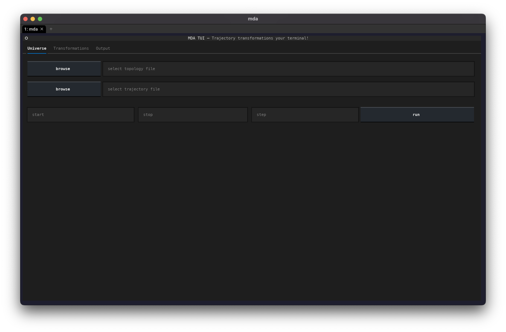

# Introduction

Trajectory transformations in your terminal

{ align=center }

## Installation

MDAnalysis TUI can be installed using pip:

```bash
python -m pip install mda-tui
```

This will install MDAnalysis TUI along with all necessary dependencies.


## Getting started

Once you've installed MDAnalysis TUI, you can use the `mda` command from your terminal to launch the app.

See the [transformations](transformations/index.md) docs for details on transformations currently available in MDAnalysis TUI.
